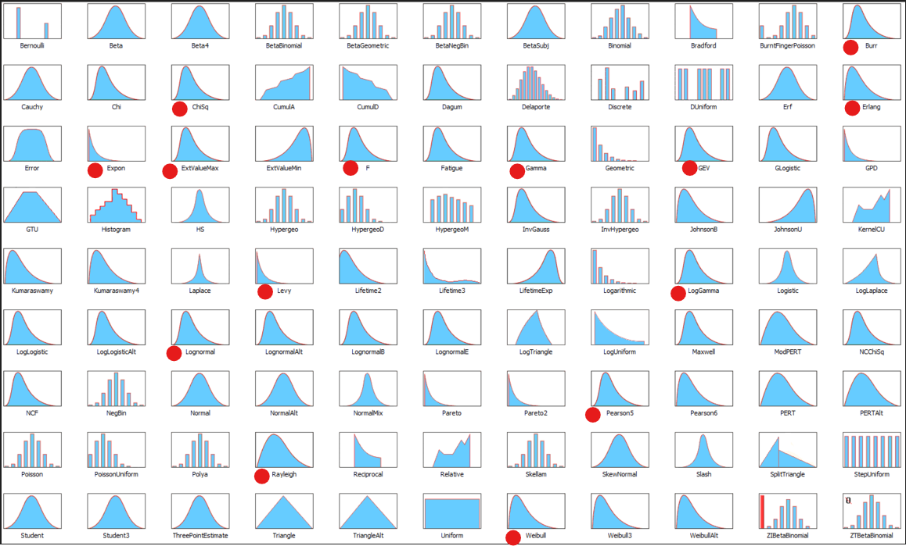

### **NOTES ON STATISTICS, PROBABILITY and MATHEMATICS**

---

### The Connections of the Gamma Distribution:

---

The gamma distribution can be thick-tailed or thin-tailed depending on its shape parameter (α) and a rate parameter ($\beta$) with pdf

$$f_X (x)=\frac{\beta^\alpha}{\color{orange}\Gamma(\alpha)} \color{red}{x^{\alpha - 1}\,e^{-\beta x}} $$

essentially the integrand of the gamma function:

$$\Gamma(z) = \int_0^\infty \color{red}{t^{z-1} \, e^{-t}}\;dt$$

Thin-tailed: When α is greater than 1, the gamma distribution has a relatively thin tail. This means that extreme values are less likely to occur.

Thick-tailed: When α is less than or equal to 1, the gamma distribution has a thicker tail, indicating a higher probability of extreme values.

The gamma distribution is explained [here](https://probabilityandstats.wordpress.com/tag/gamma-distribution).

Factorials often appear in discrete probability distributions, such as the binomial and Poisson distributions. The gamma function's connection to factorials means it can be used to derive continuous probability distributions, like the gamma and beta distributions. This ability to transition between discrete and continuous distributions enhances our toolkit in probability and statistics.

INTUITION: The pdf is just the integrand of the gamma function, and in it there is a polynomial form on the random variable, which tends to give the pdf an initial smooth upswing. Quickly, the exponential part of the pdf kicks in and kills the function. So they tend to have a positive skew. As in the case of the Weibull distribution with $k=1$, the elimination of the polynomial part turns the distribution like an exponential. Here are some of the examples discussed below, showing this tendency:

[From ModelRisk David Vose, [here](https://www.linkedin.com/pulse/8-probability-distributions-every-risk-analyst-should-david-vose)]

The gamma distribution is connected to a number of different distributions:

1. **Chi-Squared Distribution**: A special case of the gamma distribution with $α = k/2$ and $β = 2.$ If $X \sim \chi^2$ then $X\sim \Gamma(\alpha = \nu/2, \theta = 1/2)$ (in the shape-rate parameterization).

$$f_X(x)=\frac{1}{2^{k/2}\color{orange}\Gamma(k/2)}\color{red}{x^{k/2-1}\,e^{-x/2}}$$

2. **Normal distribution**: If $Y \sim N(0,1)$ then considering $X = Y^2$

$$F_X(x) = \Pr(X<x)= \Pr(Y^2 < x)= \Pr(-\sqrt x \geq y \leq \sqrt x) \implies F_X(x)= F_Y(-\sqrt 2) - F_Y(\sqrt 2)$$

Since the pdf of the normal is $\frac{1}{\sqrt{2\pi}}e^{-\frac{x^2}{2}}$, differentiating the expression above to get the equivalent with the pdf for $\sqrt x$ results in:

$$f_X(x) = \frac 1 2 x^{-1/2} \frac{1}{\sqrt{2\pi}}e^{-\frac{x}{2}}+\frac 1 2 x^{-1/2} \frac{1}{\sqrt{2\pi}}e^{-\frac{x}{2}}=  \frac{1}{\sqrt{2\pi}} x^{-1/2} e^{-\frac{x}{2}}$$

Since $\Gamma(1/2)=\sqrt \pi$

$$f_X(x) = \frac{\frac{1}{2}^{1/2}}{\Gamma(1/2)}x^{-1/2} e^{-\frac{x}{2}} \sim \Gamma(1/2,1/2)$$

which is a gamma distribution with $\lambda = 1/2$ and $\alpha = 1/2$ comparing to the form of the gamma:

$$f_X(x) = \frac{\lambda^\alpha}{\Gamma(\alpha)}x^{\alpha -1}e^{-\lambda x}$$
Naturally, it is also distributed as a $\chi^2(1 \text{df})$ (see above).

3. **Student t distribution**: It arises when a normal random variable is divided by a Chi-square or a Gamma random variable. The pdf of the t-student is

$$f_X(x)= \frac{\color{orange}\Gamma\left(\frac{\nu + 1}{2}\right)}{\sqrt{\pi \nu}\,\color{orange}\Gamma\left(\frac{\nu}{2}\right)}\left( 1 + \frac{x^2}{\nu}\right)^{-\frac{\nu+1}{2}}$$

4. **Exponential Distribution**: A special case of the gamma distribution with $α = 1$ and $β = λ.$ This distribution is used to model waiting times between events.

$$f_X (x)=\frac{\beta^\alpha}{\Gamma(\alpha)}\color{red}{x^{\alpha - 1}\,e^{-\beta x}} =\beta\,e^{-\beta x}$$

5. **Erlang Distribution:** A special case of the gamma distribution with α being a positive integer. This distribution is used to model the sum of independent exponential random variables.

$$f_X(x)=\frac{\lambda^k\,\color{red}{x^{k-1}\,e^{-\lambda x}}}{(k-1)!}$$

with $\lambda$ being the rate parameter, $k\in\{1,2,\dots\}$ the shape parmeter

6. **Weibull distribution:** A Weibull distribution is a generalized gamma distribution with both shape parameters equal to k.

$$f_X(x)=\frac{k}{\lambda}\color{red}{\left(\frac x k\right)^{k-1}\, e^{-(x/\lambda)^k}}$$

7. **Beta distribution**: If $X \sim \Gamma(α, θ)$ and $Y \sim \Gamma(β, θ)$ are independent, then $\frac{X}{X+Y}\sim \beta (α, β)$.

$$f_X(x)=\frac{x^{\alpha -1}(1-x)^{\beta-1}}{\frac{\color{orange}\Gamma(\alpha)\color{orange}\Gamma(\beta)}{\color{orange}\Gamma(\alpha +\beta)}}$$

8. **Lévy distribution**: The gamma in it may be a bit concealed, but only at first sight, but in fact they are intimately related:

$$f_X(x) = \sqrt{\frac{c}{2\pi}}\frac{e^{\frac{-c}{2(x-\mu)}}}{(x-\mu)^{3/2}}=\sqrt{\frac{c}{2\pi}}\color{red}{(x-\mu)^{-3/2}\,e^{\frac{-c}{2(x-\mu)}}}$$

If $X$ is a random variable following a gamma distribution with shape parameter α and rate parameter β, then the random variable $Y = 1/X$ follows a Lévy distribution with parameter α.

9. **GEV or Generalized Extreme Value Distribution:** In probability theory and statistics, the generalized extreme value (GEV) distribution[2] is a family of continuous probability distributions developed within extreme value theory to combine the Gumbel, Fréchet and Weibull families also known as type I, II and III extreme value distributions. 

$$f_X(x) =\frac{1}{\sigma}\color{red}{t(x)^{\xi+1}\,e^{-t(x)}}$$

where if $\xi \neq 0$

$$t(x) = \left(1 + \xi\left(\frac{x-\mu}{\sigma} \right)\right)^{-1/\xi}$$

and if $\xi = 0$

$$t(x) = \exp\left(-\frac{x -\mu}{\sigma}\right)$$

10. **Rayleigh distribution**: If $X$ is distributed as a Reyleigh distribution, the sum of squared $\sum X_i^2$ follows a gamma distribution.

$$f_X(x) = \color{red}{\frac{x}{\sigma^2}\,e^{-x^2/2\sigma^2}}$$

11. **F or Snedecor's Distribution**: It is the ratio distribution of two iid chi square distributions with d.f. $u$ and $v$:

$$X = \frac{U_1/u}{U_2/v}$$
The pdf is ([reference](https://statproofbook.github.io/P/f-pdf.html)):

$$f_F(f) = \frac{\color{orange}\Gamma\left( \frac{u+v}{2} \right)}{\color{orange}\Gamma\left( \frac{u}{2} \right) \cdot \color{orange}\Gamma\left( \frac{v}{2} \right)} \cdot \left( \frac{u}{v} \right)^{\frac{u}{2}} \cdot f^{\frac{u}{2}-1} \cdot \left( \frac{u}{v}f+1 \right)^{-\frac{u+v}{2}} $$

The gamma distribution is used in:

Survival Analysis: In survival analysis, the gamma distribution can be used to model the time to an event of interest, such as the time to failure of a component or the time to death.

Insurance: The gamma distribution is used in insurance modeling to represent the distribution of claim amounts.

Engineering: In engineering, the gamma distribution is used to model various processes, such as the time between failures of equipment or the distribution of material properties.

Waiting Times: The gamma distribution is often used to model waiting times between events, especially when the events are not independent or when the waiting time is not exponentially distributed.

---

The **"Penelope distributions"**:

  1. **Exponential**: Models the **inter-arrival time** in a Poisson process. Waiting times constant & memoryless. The continuous time analogue of the geometric distribution.

2. **Erlang**: It is a discretized form of the gamma (check the denominator, and the fact that the shape parameter $k$ has to be a positive integer)

$$f_X(x)=\frac{\lambda^k\,\color{red}{x^{k-1}\,e^{-\lambda x}}}{(k-1)!}$$
It is used to model the sum of independent exponential random variables: distribution of the waiting time until the $k$-th event of a Poisson process of rate $\lambda$. 

If $k = 1$ it becomes the exponential distribution.

3. **Weibull**: The waiting time changes over time. The big difference is in $e^{-(\cdot)}$: Whereas in the gamma distribution, or in the Erlang, we had $e^{-\lambda x}$ (a constant decay), in the Weibull the shape parameter comes into play in the exponential part. Here is the pdf of the Weibull:

$$f_X(x)= \frac{k}{\lambda}\left(\frac{x}{\lambda}\right)^{k-1}\,e^{-(x/\lambda)^k}$$

So the exponential $e^{-\left(\frac{x}{\lambda}\right)^k}$ has a polynomial shape!

Therefore the Weibull will be used to model **time-to-failure**:

* A value of $k < 1$ indicates that the failure rate decreases over time (like in case of the Lindy effect, which however corresponds to Pareto distributions[7] rather than Weibull distributions). 

* A value of $k = 1$ indicates that the failure rate is constant over time. This might suggest random external events are causing mortality, or failure. The Weibull distribution reduces to an exponential distribution.

* A value of $k > 1$ indicates that the failure rate increases with time. This happens if there is an "aging" process, or parts that are more likely to fail as time.

4. **Gamma**: While the exponential models the inter-arrival times in a Poisson  process, the gamma (in the discrete form) models the **$n$-th time of arrival** $T_n$:

$$T_n = \sum_{i=1}^n X_i \sim \text{Gamma}(n, \lambda)$$

were $X_i$ are iid exponentials.

The gamma is the continuous-time analogue of the negative binomial.

5. **Beta**: Fraction of time in a queue ('the bank and post office') explained [here](https://youtu.be/2LR5JYbhyjg?si=7HbyIQ3mwXPxIpsW&t=60). The time waiting in the bank is $X \sim \text{Gamma}(a,\lambda)$ (e.g. $a =5$ people waiting in line) with $Y \sim \text{Gamma}(b, \lambda)$ waiting at the post office. Now $W = X / (X + Y)$ follows a beta distribution $\text{Beta}(a,b).$ 

---
<a href="http://rinterested.github.io/statistics/index.html">Home Page</a>

**NOTE: These are tentative notes on different topics for personal use - expect mistakes and misunderstandings.**
