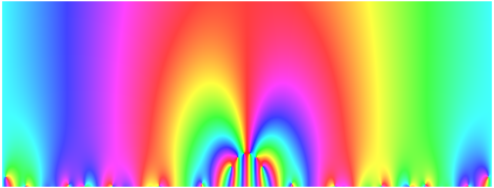
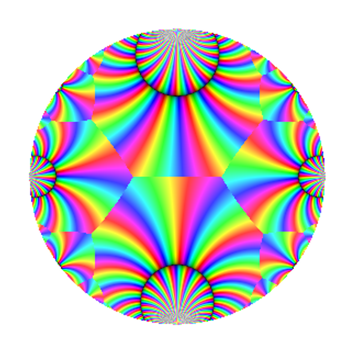
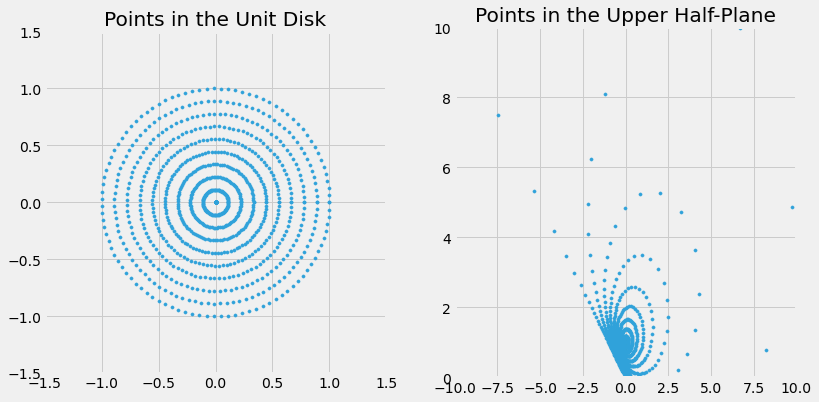
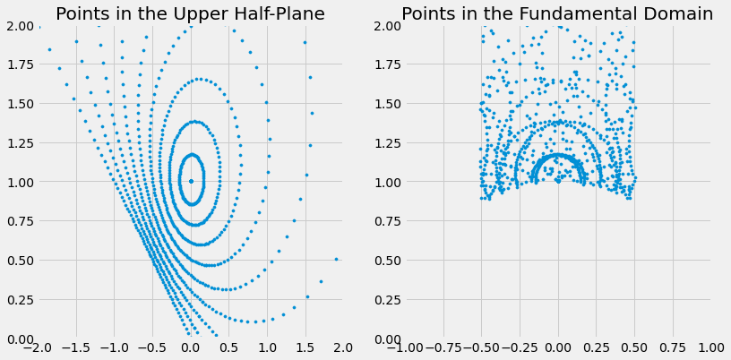
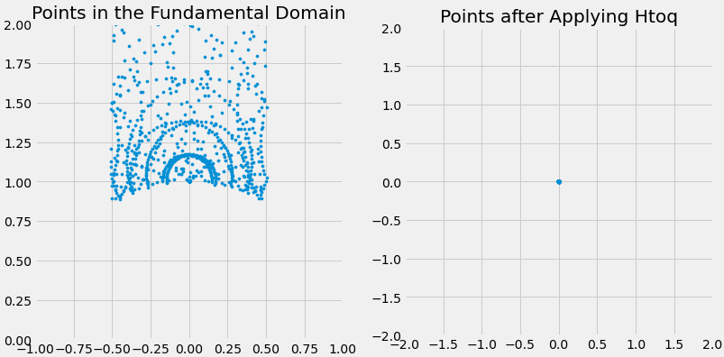

### **NOTES ON STATISTICS, PROBABILITY and MATHEMATICS**

<a href="http://rinterested.github.io/statistics/index.html">
</a>

---

### Modular Forms and Möbius transformation:

---

#### Möbius transformation:

A Möbius transformation is ([Wikipedia](https://en.wikipedia.org/wiki/M%C3%B6bius_transformation)):

In geometry and complex analysis, a Möbius transformation of the complex plane is a rational function of the form

$$f(z) = \frac{az + b}{cz + d}$$

of one complex variable $z$; here the coefficients $a, b, c, d$ are complex numbers satisfying $ad − bc ≠ 0.$

In order to plot this transformation using Cartesian coordinates on a computer platform the real and imaginary components will need to be separated.

Using [this post](https://math.stackexchange.com/q/1583277/152225):

If

* $Z$ is a point $(x, y)$, equivalent to the complex number $x+ yi$ 
* $A = a_r + a_i i$
* $B = b_r + b_i i$
* $C = c_r + c_i i$
* $D = d_r + d_i i$

(so $Z, A, B, C, D$ are complex numbers, while 
$x, y, a_r, a_i, b_r, b_i, c_r,  c_i, d_r, d_i$ are real numbers)


$$\begin{align}
f(Z)  &=   \frac{AZ+B}{CZ+D}\\[3ex]
=&\frac {(a_r x - a_i y ) + (a_i x + a_r y) i + b_r + b_i i}
{(c_r x - c_i y) + (c_i x + c_r y) i + d_r + d_i i} \\[3ex]
=
&\frac {(a_r x - a_i y ) + (a_i x + a_r y) i + b_r + b_i i}
{(c_r x - c_i y) + (c_i x + c_r y) i + d_r + d_i i} \\[3ex]
=&\frac {(a_r x - a_i y+ b_r ) + (a_i x + a_r y + b_i) i }
{(c_r x - c_i y+ d_r) + (c_i x + c_r y+ d_i) i} \\[3ex]
= & \left( \frac {(a_r x - a_i y+ b_r ) (c_r x - c_i y+ d_r) + (a_i x + a_r y + b_i) (c_i x + c_r y+ d_i) }
{(c_r x - c_i y+ d_r)^2 + (c_i x + c_r y+ d_i) ^2} \right) \\[3ex]
+ & \left( \frac {(a_i x + a_r y + b_i)(c_r x + c_i y+ d_r) -(a_r x - a_i y+ b_r )(c_i x + c_r y+ d_i ) }
{(c_r x - c_i y+ d_r)^2 + (c_i x + c_r y+ d_i)^2 } \right) i 
\end{align}$$

This is implemented [here](https://www.geogebra.org/m/DRF0L1X2).


#### Modular transformation:

A modular form $f$ is an analytic function defined with a weight $k$ and a modular group.

The transformation of the domain of the modular form is the action of the modular group.See [here](https://youtu.be/AxPwhJTHxSg?si=6kngqW3TkYn6dB8S).

Limiting the $\text{GL}_2(\mathbb Z)$ to the special linear group $\text{SL}_2(\mathbb Z)=\left\{\begin{bmatrix}a&b\\c&d\end{bmatrix}\in M_2(\mathbb Z): ad-cb=1\right\}$ acting on points on the upper-half of the complex plane:

$$\text{SL}_2(\mathbb Z)\require{HTML} \style{display: inline-block; transform: rotate(-270deg)}{\circlearrowright} \tau\in \mathcal H$$

with $\mathcal H=\{x+iy: y >0\}$.

This action is a **linear fractional transformation** (a **Möbius transformation**):

$$\begin{bmatrix}a&b\\c&d\end{bmatrix}\tau = \frac{a\tau + b}{c\tau+d}$$
Since $\tau \in \mathcal H,$ the result of the transformation will also be in the upper-half plane due to the result:

$$\Im\left( \frac{a\tau + b}{c\tau+d}\right)=\frac{(ad-bc)\,\Im(\tau)}{\vert c\tau +d\vert^2}$$

The Möbius transformations are applications such that $f(z) = \frac{az+b}{cz+d}$
are the projective transformations of the complex project line. They form a group called Möbius group, which is the projective linear $\mathbb{PGL}(2, C)$. Möbius transformations are generated by the two following matrices: $S=\begin{bmatrix}-1&0\\0&1\end{bmatrix}$ and $T=\begin{bmatrix}1&1\\0&1\end{bmatrix}$.

The complete definition of a modular form of weight $k$ for $\text{SL}_2(\mathbb Z)$ is a function in $\mathcal H$ satisfying:

1. $f$ is **holomorphic** (analytical, i.e. there is a local power series expansion in $\mathcal H$)

2. **Modularity condition**:

$$f\left( \frac{a\tau + b}{c\tau+d}\right)= (c\tau + d)^k\; f(\tau)\quad \forall \begin{bmatrix}a&b\\c&d\end{bmatrix}\in \text{SL}_2(\mathbb Z),\; \tau\in\mathcal H$$

Since this applies to all matrices in the group, it follows that it applies to $T=\begin{bmatrix}1&1\\0&1\end{bmatrix}$, and hence:

$$f\left(\frac{1\cdot \tau + 1}{0\cdot \tau + 1}\right)=f(\tau+1)=(0\cdot \tau +1)^k\,f(\tau)=f(\tau)$$
Therefore $f(\tau +1)=f(\tau),$ and the function is **periodic**.

From the matrix $S=\begin{bmatrix}0&-1\\1&0\end{bmatrix}$ we can conclude that

$$f\left(\frac{0\cdot \tau -1}{1\cdot \tau +0} \right)=f\left(-1/\tau\right)=\tau^k\,f(\tau)$$

A $\tau$ in the upper-half plane outside the unit semicircle will be transformed by $-1/\tau$ into a point within the unit semicircle (less than $1$ in modulus) and reflected through the origin (negative sign). Take a point $\tau = r\,e^{i\theta},$ its inverse is $1/\tau = 1/r\,e^{-i\theta}$ (reciprocal modulus, negative argument). The introduction of a negative sign is equivalent to multiplying by $-1 = e^{i\pi}$, yielding $-1/\tau = 1/\tau e^{i(\pi-\theta)}$ (no change in modulus, argument $\pi -\theta$).

Finally, considering the matrix $\begin{bmatrix}-1&0\\0&1\end{bmatrix}$ we get that

$$f\left(\frac{-1\cdot \tau +0}{0\cdot \tau +1} \right)=f\left(-\tau\right)=(-1)^k\,f(\tau)$$
which implies that if $k$ is odd the function has to be zero, i.e. modular forms have even weights.


3. As $\Im(\tau) \to\infty$, $f(\tau)$ is **bounded**.

This is explained in [here](https://youtu.be/LolxzYwN1TQ?si=aPsM8zy_NYDbEkPX).

---

In the LMFDB, [modular forms](https://www.lmfdb.org/ModularForm/GL2/Q/holomorphic/) are classified according to **weight** ($k$) and **level**, which is a positive integer $N$ such that $f$ is a modular form on a subgroup $\Gamma$ of $\operatorname{SL}_2(\mathbb{Z})$ that contains the principal congruence subgroup $\Gamma(N)$.

For instance, take the elliptic curve $y^2+y=x^3-x^2$ that Edward Frenkel presents in Numberphile in [here](https://youtu.be/4dyytPboqvE?si=Uhv4J6zy_Ojsj4vZ). It turns out that you can find the curve by plugging the equation in the field "Label or coefficients", and it returns `11.a3 (Cremona label 11a3)` with the corresponding modular form within the information about the elliptic curve:

$$q - 2\,q^2 - q^3 + 2\,q^4 + q^5 + 2\,q^6 - 2\,q^7 - 2\,q^9 - 2\,q^{10} + q^{11} - 2\,q^{12} + \cdots)\\[2ex]=q\,((1-q)^2\;(1-q^{11})^2\;(1-q^2)^2\;(1-q^{22})^2)\;(1-q^{3})^2\;(1-q^{33})^2\cdots$$

The plotting can be carried out in the unit disk (hyperbolic space with the **Poincaré disk model**) (see [here](https://math.uni.lu/eml/assets/reports/2016/visualizing_modular_forms.pdf)).

To understand what it represents we need to define the **fundamental domain**: The fundamental domain is a closed subset $D ⊂ X$ such that $X$ is the union of translates of $D$ under the group action $G$:

$$X = \cup_{g∈G} \;g\,D$$
Due to the fact that the Möbius transformations are generated by $T$ and $S$, the fundamental domain and its copies can be found as

$$A_{n+1} = \{A_n × T, A_n × S, A_n × T^{−1}, A_n × S^{−1}\}$$

with $A_0$ being equal to the original fundamental domain.

Let be $z ∈ H$. We call the order of $z$, and we denote $\text{ord}(z)$,
the smallest number of transformations (among $S,T,T^{−1}$) needed to transform $z$ into a complex number in the fundamental domain. Equivalently, $\text{ord}(z)$ is the minimal number of Möbius transformations needed to transform the fundamental domain into the copy of itself that includes $z$.

If the order of a complex number in the complex half-plane is even, it can be represented in black. This can already result in a nice black and white alternating image.

Using the code in this [Mathematics SE post](https://math.stackexchange.com/a/4309925/152225), the disk plot of the [modular form 11.2.a.a ](https://www.lmfdb.org/ModularForm/GL2/Q/holomorphic/11/2/a/a/) of level $11$ and weight $2$ can be created in SageMath, first confirming we have the right form:

```
lv = 11
wt = 2
ModularForms(11, 2).basis()[0]
q - 2*q^2 - q^3 + 2*q^4 + q^5 + O(q^6)
```
Here is the standard Cartesian plot:



And here is the Poincaré disk:




The patterns you see in the Poincaré disk plot are essentially visualizations of the equivalence classes of points under the modular group. The "fractal" patterns arise from the intricate way the fundamental domain tiles the upper half-plane and how these tiles map to the Poincaré disk. The FD tiles the upper half-plane. This tiling (tessellation) represents the equivalence classes of points under the modular group.

Symmetry in the Disk: Even though we're calculating in the FD, the symmetries of the modular form are reflected in the Poincaré disk plot.

The colors in the disk are based on the information that was calculated from the FD, but the placement of those colors are determined by the initial grid that was created in the Poincare disk.

The visual advantage of the distortion introduced by mapping the upper half-plane (H) to the Poincaré disk is primarily about compactness and global visualization. Here's a breakdown:

1. Compact Representation:

Infinity to Boundary: The upper half-plane extends infinitely in all directions. The Poincaré disk, on the other hand, is a finite, bounded region. This allows us to represent the entire upper half-plane (or at least a large portion of it) within a finite space. 

Complete View: This compact representation makes it possible to visualize the global structure of modular forms and their symmetries in a single, coherent image.

Visualizing Cusps: The "cusp" of the upper half-plane (infinity) is mapped to the boundary of the Poincaré disk. This allows us to visualize the behavior of modular forms near the cusp, which is often crucial for understanding their properties.

2. Visualizing Symmetries:

Conformal Mapping: The mapping from H to the Poincaré disk is a conformal mapping, which means it preserves angles. This is important because it preserves the local geometric properties of the modular forms. 

Global Symmetries: Even though the shapes of the tiles are distorted, the overall symmetries of the modular forms are still visible. The patterns in the Poincaré disk plot reflect the symmetries of the modular group and the modular form itself.

Whole Picture: The distortion allows the viewer to see the whole picture. If the image was created in the upper half plane, then the image would need to be infinitely large to display the same information.

3. Aesthetic Appeal:

Circular Boundary: The circular boundary of the Poincaré disk provides a visually appealing and natural frame for the plot.

Symmetry and Harmony: The circular symmetry of the disk often enhances the visual harmony of the patterns, making them more aesthetically pleasing.

4. Computational Advantages:

Finite Domain: Working within a finite domain (the Poincaré disk) can sometimes simplify numerical computations and plotting algorithms.

#### Code analysis of the Poincaré disk plot:

 * It starts with the points in a disk centered at the origin. This is where the output will be displayed with color mapping (hue representing phase, and brightness, absolute value). However, the calculations will be carried out in the upper half-plane $\mathbb H.$ To this effect, the points in the disk will undergo a Möbius transformation of the form:

$$h=\frac{1 - iz}{z - i}$$

 This formula is the inverse of the standard transformation from the upper half-plane to the Poincaré disk:

$$w = \frac{z - i}{z + i}$$

 As a result of this inverse transformation, the points will appear skewed and roughly circular, but distorted. This is the effect of a Möbius transformation.



 The specific form of `DtoH` used in the code, `DtoH(x) = (-I * x + 1) / (x - I)`, is a particular case of a more general class of transformations called Möbius transformations (or fractional linear transformations).

Here's the breakdown of why this works and the underlying principles:

Möbius Transformations: Möbius transformations are functions of the form:

$$f(z) = (az + b) / (cz + d)$$

where $a, b, c$, and $d$ are complex numbers, and $ad - bc ≠ 0$ (this condition ensures the transformation is invertible). Möbius transformations have several important properties: They map circles and lines to circles and lines.1 This is crucial because the boundary of the unit disk is a circle, and the boundary of the upper half-plane (the real axis) is a line. They are conformal and bijective. To map the unit disk to the upper half-plane, you need to find a Möbius transformation that takes the boundary of the unit disk ($|z| = 1$) to the real axis $Im(z) = 0$. There are infinitely many such transformations. The specific `DtoH` transformation used in the code is just one example. 

 * The second step will be to transform these points in the upper half-plane into points in the fundamental domain, which will be between $-1/2$ and $1/2$ in the real line, and will exclude a semi-circular area around the origin.
 
  The fundamental domain is designed to contain exactly one representative from each equivalence class under the action of a group.  Points are considered equivalent if they can be transformed into each other by a group action.  If multiple equivalent points fall within the fundamental domain, it violates this principle of unique representation. 

Let's consider a simplified example to illustrate the idea. Imagine a group that acts on the plane by rotations of multiples of $90$ degrees around the origin.  We want to define a fundamental domain for this group action. If we naively choose the entire plane as our "fundamental domain," then we clearly have multiple equivalent points. For example, a point at $(1,0)$, $(0,1)$, $(-1,0)$, and $(0,-1)$ are all equivalent under the rotation group, but they are all distinct points in the plane. A better choice for a fundamental domain would be, say, the region defined by $0 \leq \theta < 90$ degrees.

The region near the origin in the upper half-plane is a region where these group actions can "overlap" or "fold over" in a way that causes multiple equivalent points to fall within it. The transformations that define the group action (e.g., the modular group or related groups) often involve a combination of scaling, inversion, and translation in the complex plane.  Consider the transformation $z \to -1/z$, which is part of the modular group. This transformation inverts points and reflects them across the imaginary axis. Points close to the origin are mapped to points far away, and vice-versa. This kind of transformation can cause significant "folding" near the origin.

Here is the appearance of the final position of the dots in the FD:



This transformation is based on the group action $\circlearrowright$ on points $\tau \in \mathbb H.$ The matrix $\small \begin{bmatrix}1&-1/2\\0&1\end{bmatrix}$ will bring point along the positive axis towards the left via the action:

$$\begin{bmatrix}a&b\\c&d\end{bmatrix}\circlearrowright\tau = \frac{a\tau + b}{c\tau+d}=\frac{z -1/2}{z}$$

and if they are less than $1$ unit from the origin, they will reflect them outside the unit circle with the transformation $-1/z,$ corresponding to the action of the matrix $\small \begin{bmatrix}0&-1\\1&0\end{bmatrix}$:

$$\begin{bmatrix}a&b\\c&d\end{bmatrix}\circlearrowright\tau = \frac{a\tau + b}{c\tau+d}=\frac{ -1}{z}$$
 * Modular forms have a Fourier expansion, often called the $q$-expansion, where $q$ is related to $\tau$ (a complex number in the upper half-plane) by $q = \exp(2πi\tau)$. The polynomial (which is an approximation of the modular form) is being evaluated at this $q$ value. This is because the modular form is often expressed and computed in terms of its $q$-expansion.
 
 With the FD is comprised between $-1/2$ and $1/2$ in the real line, and between $0$ and $~ 2$ in the imaginary line (see plot above), the transformation $\exp(2\pi i \tau)$ of $\tau = a + bi$ will be $\exp(2\pi i (a+bi))= \exp(-2\pi b) \exp(2\pi\ i a)$, which can be very small for a value with an imaginary part slightly above $1$, say for example $b = 2$, $\exp(-2 \pi 2) ~ 3.5\times 10^{-6}$, leading to potential numerical instability, and the need for high-precision arithmetic libraries. On the other hand, small values of $q$ can make the infinite series decay fast, leading to more accurate calculations with fewer terms.
 
 Here is the clustering around small values that takes place when this transformation is carried out:
 
 
 
  * The `pullback` function's purpose it to find a matrix $\gamma = [[a, b], [c, d]]$ in $\text{SL}(2, \mathbb Z)$ such that $γ(z)$ (the action of $γ$ on $z$) lies within the fundamental domain. Crucially, the function returns both the transformation $γ$ and the transformed value $z$. However, it constructs the transformation matrix such that it represents the inverse of the transformation needed to bring $z$ to the fundamental domain. This is done so that when you apply $γ$ to the transformed $z$ (which is already in the fundamental domain), you can return to the original $z$.
  
  **Modularity Factor**: The modularity factor is $(cz + d)ᵏ$. But because the pullback function returns the inverse transformation, and because matrix multiplication is not commutative, the code needs to use the correct modularity factor.

Let's say the transformation that takes $z$ into the fundamental domain is represented by the matrix $[[A, B], [C, D]]$. Then the modularity factor when evaluating the modular form at the transformed point would be $(Cz + D)ᵏ$. The pullback function, however, returns the inverse transformation matrix, $[[D, -B], [-C, A]]$ (remember that the special group has determinant $1$). So, if we were to apply the inverse transformation to a point already in the fundamental domain to get the original point z, the modularity factor would be $(-Cz + A)^k$.

Here is the code:

```
# https://math.stackexchange.com/a/4309925/152225

import cmath

Htoq = lambda x: exp(2 * CDF.pi() * CDF.0 * x)
DtoH = lambda x: (-CDF.0 * x + 1) / (x - CDF.0)

C.<t> = CC[]

lv = 11
wt = 2
M4 = ModularForms(lv, wt)
f = M4.basis()[0]
coeffs = f.coefficients(list(range(20))) 
fpoly = C(coeffs)

def in_fund_domain(z):
    x = z.real()
    y = z.imag()
    if x < -0.51 or x > 0.51:
        return False
    if x*x + y*y < 0.99:
        return False
    return True

def act(gamma, z):
    a, b, c, d = gamma
    return (a*z + b) / (c*z + d)

def mult_matrices(mat1, mat2):
    a, b, c, d = mat1
    A, B, C, D = mat2
    return [a*A + b*C, a*B + b*D, c*A + d*C, c*B + d*D]

Id = [1, 0, 0, 1]

def pullback(z):
    """
    Returns gamma, w such that gamma(z) = w and w is
    (essentially) in the fundamental domain.
    """
    z = CDF(z)
    gamma = Id
    count = 1
    while not in_fund_domain(z):
        count += 1
        x, y = z.real(), z.imag()
        xshift = -floor(x + 0.5)
        shiftmatrix = [1, xshift, 0, 1]
        gamma = mult_matrices(shiftmatrix, gamma)
        z = act(shiftmatrix, z)
        if x*x + y*y < 0.99:
            z = -1/z
            gamma = mult_matrices([0, -1, 1, 0], gamma)
    return gamma, z

#def smart_compute(z):
#    gamma, z = pullback(DtoH(z))
#    a, b, c, d = gamma
#    scale = 1000
#    return (-c*z + a)**wt * fpoly(Htoq(z)) * scale

def smart_compute(z, scale=1e6, log_scale=100): #Added log_scale
    gamma, z = pullback(DtoH(z))
    a, b, c, d = gamma
    value = (-c*z + a)**wt * fpoly(Htoq(z)) * scale
    if abs(value) > 0:
        return cmath.log(abs(value) * log_scale) * cmath.exp(cmath.phase(value)*1j)
    else:
        return 0

pts = 300
P = complex_plot(
  lambda z: 0 if abs(z) >= 0.9
            else smart_compute(z) * exp(1.2 * CDF.pi() * CDF.0),
  (-1, 1), (-1, 1), aspect_ratio=1, figsize=[8, 8],
  plot_points=pts)

P.axes(show=False)
P
```


---
<a href="http://rinterested.github.io/statistics/index.html">Home Page</a>

**NOTE: These are tentative notes on different topics for personal use - expect mistakes and misunderstandings.**
