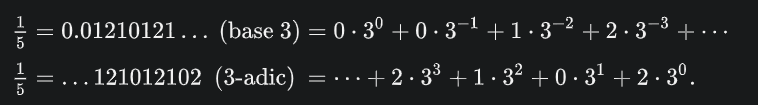

### **NOTES ON STATISTICS, PROBABILITY and MATHEMATICS**

<a href="http://rinterested.github.io/statistics/index.html">
</a>

---

## Calculations with p-adics:

---

#### Fractions:

Simple algorithm compared to long division based on a couple of examples:

Based on [this YT presentation](https://youtu.be/cP0-69P2lJw?si=MzQmGH3S_VS1pEa-), let's look first at the decimal expansion of $1/3$:

$$\frac 1 3 = \frac {c_0}{10^0} + \frac {c_1}{10^1} + \frac {c_2}{10^2} + \frac {c_3}{10^3}+ \dots  $$

Multiplying $\times 3$

$$1= 3\left(\frac {c_0}{10^0} + \frac {c_1}{10^1}  + \frac {c_2}{10^2} + \frac {c_3}{10^3}+ \dots \right)  $$

$c_0$ (in $\frac{c_0}{10^0}$), multitplied times $3$ doesn't fit into $1$, and hence $c_0$ is $0.\cdots$, and this gets us to the point when we have to add a zero $0$ to the right of $1$ to find $c_1$ (i.e. multiply $\times 10$). Naturally,


$$10 = 3\left( c_1 + \frac {c_2}{10^1} + \frac {c_3}{10^2}+ \dots \right) $$

Now $3 c_1=10 \implies c_1 = 3$ and

$$1=10 - 9 = 3\left( \frac {c_2}{10^1} + \frac {c_3}{10^2}+ \dots \right) $$

Again we have to multiply by ten:

$$10 = 3\left(c_2 + \frac{c_3}{10^1}+ \dots \right)$$

and we see that $C_2=3.$ Et cetera.

This is mirrored in the p-adics as follows.

#### Calculating p-adic expansions for fractions ($1/3$ in $5$-adic):


$1/3$ in $ \mathbb Q_5:$


$$1 = 3\left(a_0 + a_1\, p + a_2 \, p^2+ \dots \right) $$

will result in $$a_0= 2$$ 

because $3\times 2 = 6 \equiv 1 \mod(5).$ 

$$1 = 3\left(2 + a_1\, p + a_2 \, p^2+ \dots \right) $$

Subtracting from both sides:

$$1 - 6= -5 = 3\left(a_1\, p + a_2 \, p^2+ \dots \right)$$

Since we are operating $\mod(5)$ the result on the LHS will be a multiple of $5$. Now dividing by $5$ on both sides:

$$4 \mod(5) \equiv -1 = 3\left(a_1 + a_2 \, p^1+ \dots \right)$$

will yield $$a_1 = 3$$ 

since $3 \times 3 = 9\equiv 4 \mod(5).$

Rinse and repeat:

$$-1 - 9= -10 = 3\left(a_2\, p + a_3 \, p^2+ \dots \right)$$

Divide by $5$:

$$3 \mod(5) \equiv -2 = 3\left(a_2 + a_3 \, p+ \dots \right)$$

yielding 

$$a_2=1$$

Rinse and repeat:

$$-2-3=-5 = 3\left( a_3\,p+ a_4\,p^2\dots \right)$$

Divide by $5$:

$$4 \mod(5)\equiv -1 = 3\left( a_3+ a_4\,p\dots \right)$$

so $$a_3=3$$ 

Et cetera.


$$
\require{enclose}
\begin{array}{rll}
     & \color{blue}{2}\,\color{red}{3}\,\color{magenta}{1}\,\color{green}{3}\dots  \\[-3pt]
   3 &\enclose{longdiv}{\phantom{0}1}\kern-.2ex \\[-3pt]
      & \underline{-6} && \hbox{($\color{blue}{2} \times 3 = 6\equiv 1\mod(5)$)} \\[-3pt]
      &-5\phantom{0}\to -1 && \hbox{($-5/p = -1\equiv 4\mod(5)$)}\,\hbox{($-5/p=3(x_1 + x_2p^1+ x_3p^2+\cdots)$)} \\[-3pt]
      &\phantom{0000000}\underline{-9\phantom{0}} && \hbox{($\color{red}{3} \times 3 =9 \equiv 4 \mod(5)$)} \\[-3pt]
      &\phantom{00000}-10 &\to -2 & \hbox{($-10/p = -2\equiv 3\mod(5)$)}\,\hbox{($-10/p=3(x_2+ x_3p+\cdots)$)} \\[-3pt]
      &&\phantom{000}\underline{-3} & \hbox{($\color{magenta}{1} \times 3 = 3\equiv 3\mod(5)$)} \\[-3pt]
       &&\phantom{00}-5 \to -1 & \hbox{($-5/p = -1\equiv 4\mod(5)$)}\,\hbox{($-5/p=3(x_3+\cdots)$)} \\[-3pt]
       &&\phantom{00000000}-9 & \hbox{($\color{green}{3} \times 3 = 9\equiv 4\mod(5)$)}\\[-3pt]
       &&&\vdots
  \end{array}
$$


In SageMath:

```
padic_printing.mode('digits')
print(Qp(5)(1/3))
...31313131313131313132
padic_printing.mode('series')
print(Qp(5)(1/3))
2 + 3*5 + 5^2 + 3*5^3 + 5^4 + 3*5^5 + 5^6 + 3*5^7 + 5^8 + 3*5^9 + 5^10 + 3*5^11 + 5^12 + 3*5^13 + 5^14 + 3*5^15 + 5^16 + 3*5^17 + 5^18 + 3*5^19 + O(5^20)
```

$$...31313131313131313132 = 2 + 3\cdot 5 + 5^2 + 3\cdot 5^3 + 5^4 + 3\cdot 5^5 + 5^6 + 3\cdot 5^7 + 5^8 + 3\cdot 5^9 + 5^{10} + 3\cdot 5^{11} + O(5^{12})$$

---


Another example: $2/3$ in $5$-adic:

In Sagemath:

```
padic_printing.mode('digits')
print(Qp(5)(2/3))
...13131313131313131314
padic_printing.mode('series')
print(Qp(5)(2/3))
4 + 5 + 3*5^2 + 5^3 + 3*5^4 + 5^5 + 3*5^6 + 5^7 + 3*5^8 + 5^9 + 3*5^10 + 5^11 + 3*5^12 + 5^13 + 3*5^14 + 5^15 + 3*5^16 + 5^17 + 3*5^18 + 5^19 + O(5^20)
```

$$2 = 3\left(a_0 + a_1\, p + a_2 \, p^2+ \dots \right) $$

$$a_0=4$$ 

because $3 \times 4 = 12\equiv2 \mod(5)$

Now

$$2-3 \times 4= -10 = 3\left(a_1\, p + a_2 \, p^2+ \dots \right) $$

Divide by $5$

$$3 \mod(5)\equiv -2 = 3\left(a_1 + a_2 \, p+ \dots \right) $$

yields

$$a_1 = 1$$

and therefore

$$-2 -3=-5= 3\left(a_1 + a_2 \, p+ \dots \right) $$

divide by $5$

$$4 \mod(5)\equiv -1 = 3\left( a_2 + a_3\, p+ \dots \right) $$

and 

$$a_2=3$$

Subtract

$$-1 - 9=-10= 3\left(a_3\, p+ \dots \right) $$

Divide by $5$

$$3\mod(5)\equiv-2= 3\left(a_3\, p+ \dots \right) $$

yielding

$$a_3=1$$

And so on.

Notice that this would break if we tried $1/24$ in $2$-adics:

$$1=24\, (a_0+ a_1 \,p + a_2 \,p^2+\dots)$$

because there is no number $n$ such that $24 \, n\equiv 1\mod(2).$ Hence we we'll need the factorization trick explained below with $1/24= 1/3\times 2^{-3}.$

---

[Wikipedia example](https://en.wikipedia.org/wiki/P-adic_number) of $1/5$ in $3$-adics:



$$
\require{enclose}
\begin{array}{rll}
     & \color{blue}{2}\,\color{red}{0}\,\color{magenta}{1}\,\color{green}{2}\dots  \\[-3pt]
   5 &\enclose{longdiv}{\phantom{0}1}\kern-.2ex \\[-3pt]
      & \underline{-10} && \hbox{($\color{blue}{2} \times 5 = 10\equiv 1\mod(3)$)} \\[-3pt]
      &-9\phantom{0}\to -3 && \hbox{($-9/p = -3\equiv 0\mod(3)$)}\,\hbox{($-9/p=5(x_1 + x_2p^1+ x_3p^2+\cdots)$)} \\[-3pt]
      &\phantom{0000000}\underline{-0\phantom{0}} && \hbox{($\color{red}{0} \times 5 =0 \equiv 0 \mod(3)$)} \\[-3pt]
      &\phantom{000000}-3 &\to -1 & \hbox{($-3/p = -1\equiv 2\mod(3)$)}\,\hbox{($-3/p=5(x_2+ x_3p+\cdots)$)} \\[-3pt]
      &&\phantom{000}\underline{-5} & \hbox{($\color{magenta}{1} \times 5 = 5\equiv 2\mod(3)$)} \\[-3pt]
       &&\phantom{00}-6 \to -2 & \hbox{($-6/p = -2\equiv 1\mod(3)$)}\,\hbox{($-6/p=5(x_3+\cdots)$)} \\[-3pt]
       &&\phantom{00000000}-10 & \hbox{($\color{green}{2} \times 5 = 10\equiv 1\mod(3)$)}\\[-3pt]
       &&&\vdots
  \end{array}
$$


In SageMath the $3$-adic expansion is:


```
padic_printing.mode('series')
print(Qp(3)(1/5))
2 + 3^2 + 2*3^3 + 3^4 + 3^6 + 2*3^7 + 3^8 + 3^10 + 2*3^11 + 3^12 + 3^14 + 2*3^15 + 3^16 + 3^18 + 2*3^19 + O(3^20)
padic_printing.mode('digits')
print(Qp(3)(1/5))
...21012101210121012102
```

whereas base $3$ base expression is

$$0.012101210121\dots_3$$


___


#### p-adic expansion of integers:


P-adics expand to infinity on to the left as in $\mathbb Z_3,$ corresponding to the $3$-adics. For example, in this system the number $3$ is

$$...00000000000000000010 =  0 \cdot 3^0 + 1 \cdot 3^1 $$ 

In Sage

```
padic_printing.mode('digits')
print(Zp(3)(3))
...000000000000000000010
padic_printing.mode('series')
print(Zp(3)(3))
3 + O(3^21)
```

For natural numbers, the p-adic representation and the base-p representation are essentially the same. For natural numbers, the p-adic representation will have only a finite number of non-zero terms, effectively reducing to the base-p representation.

For example, compare the $5$-adic expansion of $233$

$$...00000000000000001413 = 3 + 5 + 4\cdot 5^2 + 5^3+\cdots$$

```
padic_printing.mode('series')
print(Qp(5)(233))
3 + 5 + 4*5^2 + 5^3 + O(5^20)
padic_printing.mode('digits')
print(Qp(5)(233))
...00000000000000001413
```

to the expression mod $5$:

$$233 \mod(5)= 3 + 1 \cdot 5^1 + 4 \cdot 5^2 + 1\cdot 5^3
$$

```
a = 233
base = 5
print(" + ".join([f"{digit}*{base}^{i}" if i > 0 else str(digit) for i, digit in enumerate(a.digits(base)) if digit]))
3 + 1*5^1 + 4*5^2 + 1*5^3
```

The negative reals are simply the additive inverses of their positive counterparts, so
$-1 = ...11111111$

Because

$$...11111111 + ...00000001 = ...000000$$

since in base $2$ and summing from right to left, $1 + 1 = 0$ and we carry $1$ to the left to add it to the $1$ in the second position in the expression of $-1.$

#### Negative exponents in p-adics:

Negative exponents typically come into play when dealing with fractions or representing very small numbers in the p-adic number system.

In the p-adic number system, fractions that involve negative exponents emerge when the denominator of the fraction is divisible by $p$, the base of the system. This is because the p-adic expansion needs to represent the fractional part appropriately by incorporating terms with negative exponents. Let's consider an example in the $5$-adic system: Let's take $1/25$. Convert to $5$-adic Expansion: $1/25=5^{−2}$.

#### Digits to the right of the period in $p$-adic expressions (e.g. $.011$):

How are the finite digits ($.011$) to the right of the period calculated in an expression such as $...10101010101010101.011$, and where do they come from?

The issue comes up in the introduction of $\mathbb Q_p$ numbers. For instance, in the case of the 2-adic expression of $\frac 1{24}$. P-adic numbers can be factored as

$$n = p^k \, \text{unit}$$
where $k$ is an exponent measuring the valuation of the p-adic as $\frac 1{p^k}$, and the $\text{unit}$ is... well quick review:

> A **unit** in a ring is an element that has a multiplicative inverse. In other words, if $a$ is a unit, there exists an element $b$ in the ring such that $a \cdot b = 1$.
> A **zero divisor** is a non-zero element $a$ in a ring such that there exists a non-zero element $b$ where $a \cdot b = 0.$

Therefore, in the case of a fraction:

$$\frac m n = \frac m{p^k} \frac 1{\text{unit}}= \frac 1{\text{unit}}p^{-k}$$

Applying it to the example of $1/24,$ the denominator can be factorized as $2^3 \cdot 3:$

$$\frac 1{24}=\frac 1 3 \cdot 2^{-3}$$

$1/3$ is just the multiplicative inverse of $3,$ which can be obtained in sagemath as:

```
from sage.all import *
from sage.rings.padics.padic_printing import pAdicPrinter
padic_printing.mode('digits')
print(Qp(2)(1/3))
# ...10101010101010101011
```

and easily confirmed to be accurate:

```
third = Qp(2)(1/3)
three = Qp(2)(3)
print(third * three)
# ...00000000000000000001
```
Therefore,

$$1/24 = ...10101010101010101011 \cdot 2^{-3}$$

but since we are operating in base $2,$ the factor $2^{-3}$ just moves the period to the right, like $10^{-3}$ would in base $10.$ In this way, we get the final result:

$$1/24=...10101010101010101.011=1\cdot2^{-3} + 1\cdot2^{-2}+0\cdot2^{-1}+1\cdot2^{0} + 0\cdot2^{1}+ 1\cdot2^{2}+0\cdot2^{3}+1\cdot2^{4}$$

or in sagemath

```
padic_printing.mode('digits')
print(Qp(2)(1/24))
...10101010101010101.011
padic_printing.mode('series')
print(Qp(2)(1/24))
2^-3 + 2^-2 + 1 + 2^2 + 2^4 + 2^6 + 2^8 + 2^10 + 2^12 + 2^14 + 2^16 + O(2^17)
```

---

#### Hensel's lemma:

A **simple root** of a polynomial is a root where the polynomial crosses the x-axis and does not touch or bounce off it. A root $r$ of a polynomial $f(x)$ is considered simple if $f(r) = 0$ and the derivative  $f'(r)\neq 0$. This means that at $r$, the polynomial has a non-zero slope, indicating that it crosses the x-axis at that point. In contrast, a multiple root (or repeated root) would satisfy $f(r) = 0$ and $f’(r) = 0$, meaning the polynomial touches or bounces off the x-axis at $r$ but does not cross it.

If a polynomial has a simple root modulo a prime $p$, Hensel’s theorem allows us to lift this root to a root modulo $p^k$ for any $k$. This process can be extended to find roots in the p-adic integers $\mathbb{Z}_p$.

$$a_{n+1}\equiv a_n \mod{p^{n+1}}$$

and

$$f(a_n)\equiv 0 \mod {p^{n+1}}$$

will allow the construction of a sequence of entries in the p-adic expression.

For instance (see [here](https://youtu.be/gsg1x6mxVIA?si=EPeR-rniYi6wkq6D)), $f(x) = x^2 + 1$ has two solutions $\mod{5}$: $3$ with multiplicity $1$, and $2$ with multiplicity $1.$

```
R.<x> = GF(5)[]
p = x^2 + 1
p.roots()
# [(3, 1), (2, 1)]
```

These will start the sequence in the p-adic (of $5$-adic) expansion. So for $r = 2,$ this will be $a_0=2.$ For $a_1,$ the equation above is

$$\begin{align} a_1 &\equiv a_0 \mod{5^1}\\
a_1 &\equiv 2 \mod{5} \\
a_1 &= 2 + 5t
\end{align}$$

and

$$\begin{align} 
f(a_1) &\equiv 0 \mod{5^2}\\
(2 + 5t)^2 + 1 &\equiv 0 \mod{5^2} \\
t &\equiv 1 \mod {5^2}
\end{align}$$

yielding

$$\begin{align} 
a_1 = 2 + 5 \cdot 1 =7
\end{align}$$

And at this point we are ready for 

$$\begin{align} 
a_2 &\equiv a_1 \mod{5^2}\\
a_2 &\equiv 7 \mod{25}\\
a_2 &= 7 +25t
\end{align}$$

and $$(7 +25t)^2+1 \equiv 0 \mod{5^3}$$

which results in $a_2 =57.$

Progressing to

$$\begin{align} 
a_3 &\equiv a_2 \mod{5^3}\\
a_3 &\equiv 57 \mod{125}\\
a_3 &= 57 +125t
\end{align}$$

which can be plugged into the function:

$$(57+125t)^2 + 1\equiv 0 \mod{5^4}$$

resulting in $t=1$ and $a_3 =57 + 125 = 182$

In sagemath,

```
import numpy as np

def hensel(roots, p):
    first_root = roots[0][0]
    scnd_root = roots[1][0]
    first_root_str = str(first_root).replace('...', '')
    first_root_list = [int(digit) for digit in first_root_str]
    first_root_list_reversed = first_root_list[::-1]
    first_result = [digit * (p ** i) for i, digit in enumerate(first_root_list_reversed)]
    scnd_root_str = str(scnd_root).replace('...', '')
    scnd_root_list = [int(digit) for digit in scnd_root_str]
    scnd_root_list_reversed = scnd_root_list[::-1]
    scnd_result = [digit * (p ** i) for i, digit in enumerate(scnd_root_list_reversed)]

    return [np.cumsum(first_result), np.cumsum(scnd_result)]
padic_printing.mode('series')
R.<x>  = Qp(5,8)[]
p = x^2 + 1
p.roots()
#[(2 + 5 + 2*5^2 + 5^3 + 3*5^4 + 4*5^5 + 2*5^6 + 3*5^7 + O(5^8), 1),
 (3 + 3*5 + 2*5^2 + 3*5^3 + 5^4 + 2*5^6 + 5^7 + O(5^8), 1)]
padic_printing.mode('digits')
R.<x> = Qp(5,8)[]
p = x^2 + 1
p.roots()
#[(...32431212, 1), (...12013233, 1)]
roots = p.roots()
hensel(roots, 5)
#[array([     2,      7,     57,    182,   2057,  14557,  45807, 280182]),
 array([     3,     18,     68,    443,   1068,   1068,  32318, 110443])]
```

Notice how this makes sense: 

```
2 + 5 + 2*5^2 = 57
```


---
<a href="http://rinterested.github.io/statistics/index.html">Home Page</a>

**NOTE: These are tentative notes on different topics for personal use - expect mistakes and misunderstandings.**
